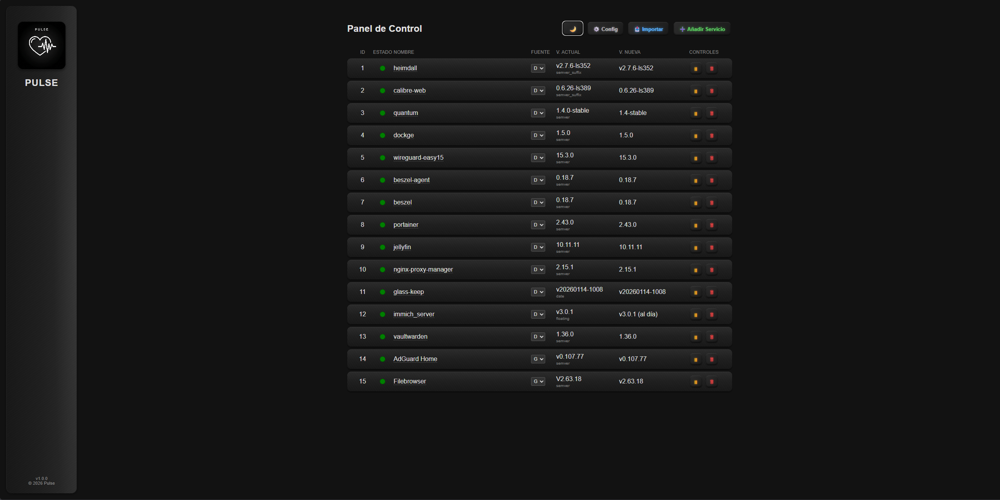
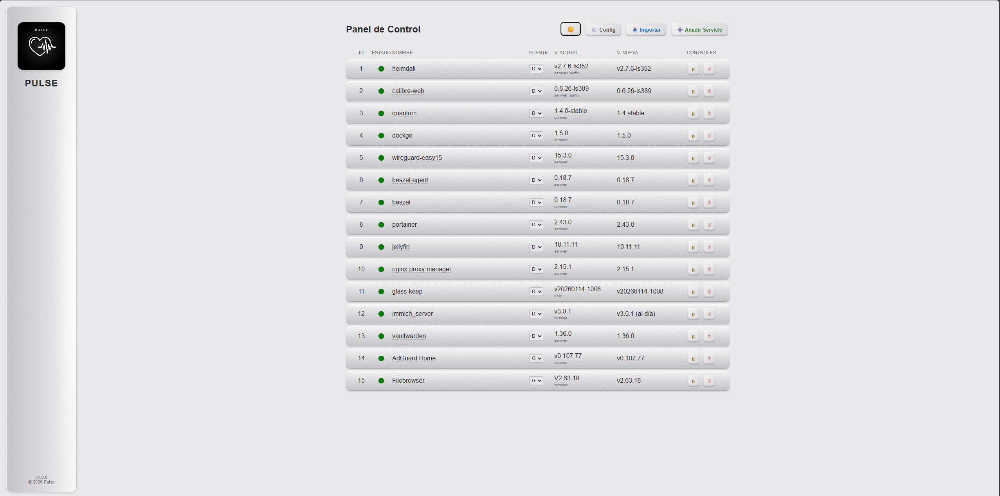
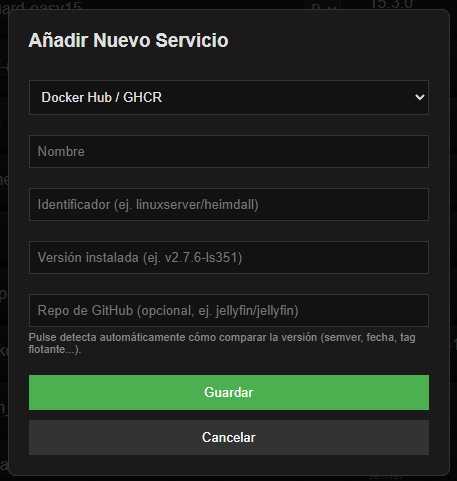
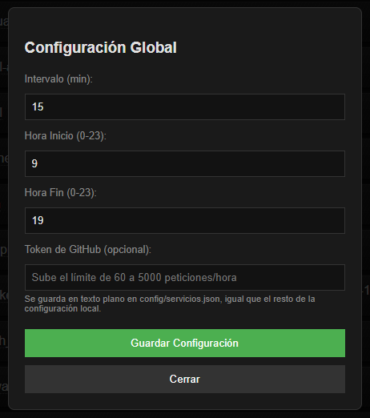

# Pulse

*[Read in English](./README.md)*

Panel ligero de autocomprobación y notificación de actualizaciones para contenedores Docker y aplicaciones autoalojadas.

Pulse nace para sustituir combinaciones más pesadas de lo necesario para una tarea sencilla: saber si tienes una versión nueva disponible de tus contenedores, sin tener que mantener un navegador headless corriendo una extensión (como Distill) solo para vigilar páginas de releases, y sin las inconsistencias de herramientas como Watchtower o WUD a la hora de identificar correctamente la última versión real de cada imagen.

## Capturas de pantalla

| Modo oscuro | Modo claro |
|---|---|
|  |  |

| Añadir Servicio | Config |
|---|---|
|  |  |

## Qué hace

- Vigila imágenes de **Docker Hub**, **GHCR** y **repos de GitHub** en un único panel.
- Detecta automáticamente cómo comparar la versión de cada servicio (semver, semver con sufijo de build tipo LinuxServer, versionado por fecha, digest de imagen pinneada, o tag flotante como `latest`/`release`), en vez de aplicar una única heurística genérica a todo.
- Importa automáticamente los contenedores que ya tienes en marcha leyendo el socket de Docker, y se excluye a sí mismo.
- Sincroniza la versión instalada con el contenedor real antes de cada comprobación, así que si actualizas algo por tu cuenta (por ejemplo con Portainer), Pulse lo detecta solo.
- Notifica por Telegram cuando hay una actualización real disponible.
- Panel web con estado por semáforo:
  - 🟢 Verde — versión al día
  - 🟡 Amarillo — hay una actualización disponible
  - 🔴 Rojo — error al comprobar (o aún sin comprobar)
  - ⚪ Gris — comprobación pausada para ese servicio
- Ventana horaria y frecuencia de comprobación configurables desde el propio panel.
- Pensado para consumir pocos recursos: sin navegador, sin dependencias pesadas.

## Instalación

Pulse no publica todavía una imagen precompilada — se construye localmente con Docker Compose.

1. Clona el repositorio:

   ```bash
   git clone https://github.com/Nolandrg/pulse.git
   cd pulse
   ```

2. Copia el archivo de ejemplo de variables de entorno y edítalo con tus datos:

   ```bash
   cp .env.example .env
   ```

3. Levanta el contenedor:

   ```bash
   docker compose up -d --build
   ```

4. Abre el panel en `http://<tu-servidor>:8060`.

## Configuración

Variables de entorno (se definen en tu `.env` o directamente en el `docker-compose.yml`):

| Variable | Obligatoria | Descripción |
|---|---|---|
| `TELEGRAM_TOKEN` | No | Token de tu bot de Telegram, para recibir notificaciones de actualizaciones |
| `TELEGRAM_CHAT_ID` | No | ID del chat/usuario al que se envían las notificaciones |
| `TZ` | No | Zona horaria del contenedor (ej. `Europe/Madrid`) |
| `DEFAULT_INTERVAL` | No | Intervalo de comprobación en minutos si no hay uno guardado aún (por defecto 30) |
| `GITHUB_TOKEN` | No | Token personal de GitHub para subir el límite de peticiones de 60 a 5000/hora. También se puede configurar desde el propio panel, en Config |

El resto de ajustes (intervalo, horario de comprobación, servicios vigilados) se gestionan desde el panel web, no por archivo. `config/servicios.json` se crea automáticamente en el primer arranque y no se sube al repositorio (está en `.gitignore`, ya que puede contener tu token de GitHub si lo guardas desde el panel).

## Uso básico

- **Importar**: escanea los contenedores en marcha en el host y los añade al panel automáticamente.
- **Añadir Servicio**: da de alta manualmente un servicio que no sea un contenedor local (por ejemplo, un programa instalado directamente en el sistema).
- Haz clic en el **nombre** de cualquier servicio para ir a su página de origen (repo de GitHub, o tags de Docker Hub/GHCR).
- Haz clic en el **LED** de un servicio para forzar una comprobación inmediata de ese servicio.
- Haz clic en el número de la columna **V. ACTUAL** para corregir manualmente la versión instalada.

### ⚠️ Diferencia importante: contenedores Docker vs. programas del sistema

- Para un **contenedor Docker**, el LED hace las dos cosas a la vez: relee qué versión tienes corriendo de verdad (por si la actualizaste tú, con Portainer, Dockge, etc.) y busca la última disponible en internet. Por eso basta con pulsar el LED tras actualizar.
- Para un **programa instalado directamente en el sistema operativo** (tipo GitHub, sin contenedor -- por ejemplo AdGuard Home o Filebrowser en una instalación típica), Pulse **no tiene ninguna forma de saber qué versión tienes instalada por sí solo** -- no existe un socket ni una API equivalente al de Docker para preguntárselo al sistema operativo. El LED de estos servicios solo busca la última versión disponible; **nunca actualiza la instalada**.
  - Si actualizas uno de estos programas a mano, tienes que decírselo tú a Pulse: haz clic en el número de la versión instalada (columna V. ACTUAL) y escribe la nueva. Al guardar, comprueba al instante si ya estás al día.

## Licencia

Pulse se distribuye bajo **AGPL-3.0 con la Commons Clause añadida**. En resumen:

- Puedes usar, modificar y redistribuir el código libremente, incluso dentro de un conjunto más grande (por ejemplo, una distribución Linux).
- Si modificas Pulse y lo ofreces en red (aunque sea gratis), estás obligado a publicar el código de tus cambios.
- No está permitido vender Pulse, ni ofrecerlo como servicio de pago, ni redistribuir un producto cuyo valor derive sustancialmente de él, sin autorización expresa del autor.

Consulta el archivo [`LICENSE`](./LICENSE) para el texto legal completo.

## Autor

David Rebollo García ([@Nolandrg](https://github.com/Nolandrg))

Preguntas, sugerencias o reportes de errores son bienvenidos a través de GitHub Issues.
